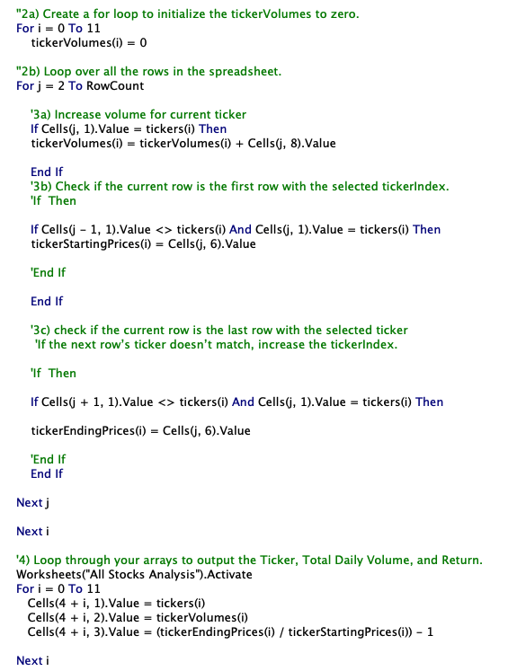
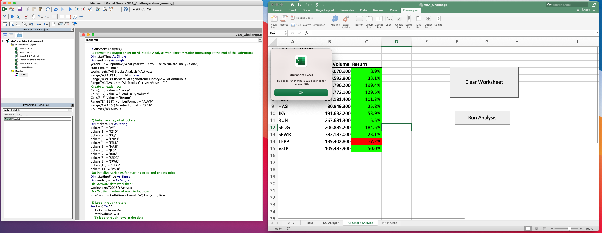
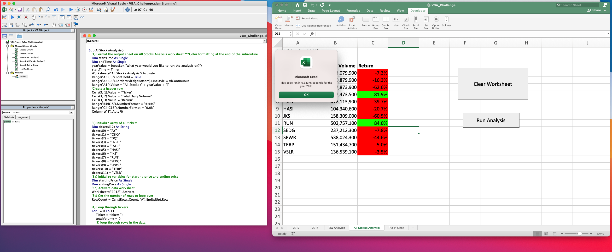
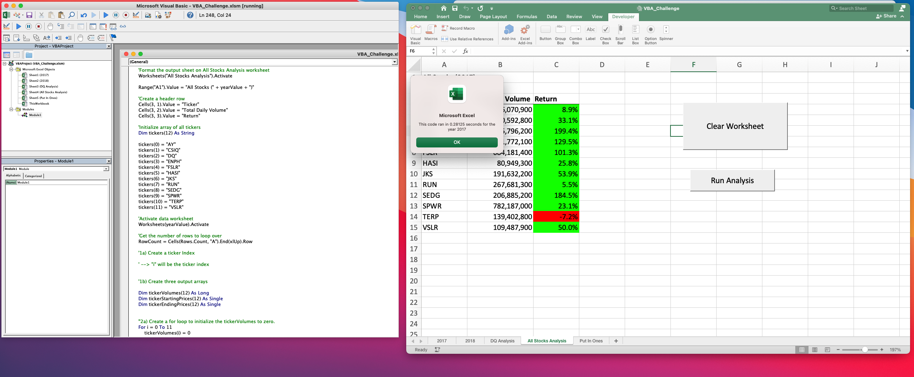
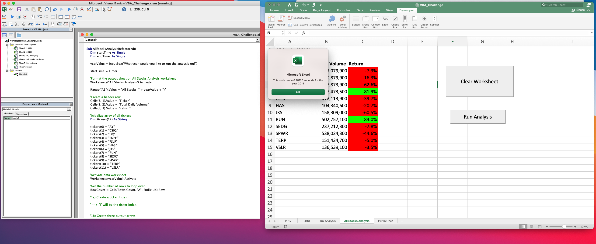

# Vanderbilt University Data Analytics Bootcamp Module 1: Refactoring _VBA_
## Project Overview
The Vanderbilt University Data Analytics Bootcamp is a streamline of coursework that exposes students to a broad set of technical applications and data management concepts, strengthening their problem solving skills in data-driven contexts. Module 2 of the course focuses on streamlining analyses in Microsoft Excel with subroutines in Visual Basic, focusing on creating readable code, static and conditional fomatting, for loops and nested for loops, buttons, and measuring code performance.  

This module culminated in a challenge tasking students with refactoring a subroutine that analyzes stock performance (Sub AllStocksAnalysis), with the goal of decreasing processing time.  Processing speed is tracked with a timer, which starts after the subroutine is initiated by clicking the "Run Analysis" button, when the user inputs the year framing the analysis (2017 or 2018), and ends when the subroutine is finished, after which the run time is confirmed via message box.

[Analysis with original subroutine](Module2_VBA/stock-analysis/green_stocks.xlsm])

[Analysis with refactored subroutine](Module2_VBA/stock-analysis/VBA_Challenge.xlsm)

The challenge will exemplify how code can be better streamlined with refactoring and yield opportunity to analyze why the refactoring was effective, informing strategy for building subroutines. In addition, students are challenged to write clear code that can be easily assessed.

## Results
The subroutine was refactored by adding arrays that could house the data for all stocks (Volume, Starting Price, Ending Price).  This made it possible to restructure for loops to perform fewer operations in every iteration.  

For example, the original subroutine had a nested for loop (in section 4) that _both_ 1) found values to assign to a single stock(Total Volume, Starting Price, and Ending Price) and 2) print the data in the "All Stocks Analysis" for the single stock in the worksheet with each iteration of i.

[For Loop Structure Before Refactoring](stock-analysis/Resources/GetTickerData_AndPrint.png)

Once refactored, finding ticker data (steps 2a - 3c) and printing the data (steps 4) were separated into different for loops.  Data gathering (assign starting and ending prices, totaling trading volume) for all stocks could be processed in the for loop in sections 2a - 3c, and printing of the data for all stocks could be processed in separate loop, in section 4.

[For Loop Structure After Refactoring](stock-analysis/Resources/GetTickerData_AndPrint.png)

Before refactoring, the run time for the subroutine was .35 seconds for the analysis of 2017 stocks and .34 seconds for that of 2018 stocks.

[2017 Timer Results, Before Refactoring](Resources/AllStocksAnalysis_2017Results.png)

[2018 Timer Results, Before Refactoring](stock-analysis/Resources/AllStocksAnalysis_2018Results.png)

After refactoring, the run time for the subroutine was .28 seconds for the analysis of 2017 stocks and .28 seconds for the analysis of 2018 stocks.  

[2017 Timer Results, After Refactoring](stock-analysis/Resources/VBA_Challenge_2017.png)

[2018 Timer Results, After Refactoring](stock-analysis/Resources/VBA_Challenge_2018.png)

Both analyses ran roughly 20% more quickly.  It is likely that breaking the for loops into more efficient iterations yielded the improved processing speeds.  Further inquiry and introspection will be explored in class to detail the aspects of the refactoring that drove the quicker processing speed.

## Summary

Refactoring the code can yield improved processing times, which enabled the subroutine analyzing stock data to run more quickly.  This suggests that refactoring subroutines can better adapt them for data analyses at greater scale.  Three additional arrays were needed to store the data gathered for each stock, which might be an example of how refactoring can be laborious and lengthen the time invested for developing subroutines, as more types of data structures may be needed. Understanding the costs of restructuring (adding new structures or data types), but also their benefits can inform whether or not the refactoring is worth the resources and time commited to its execution.